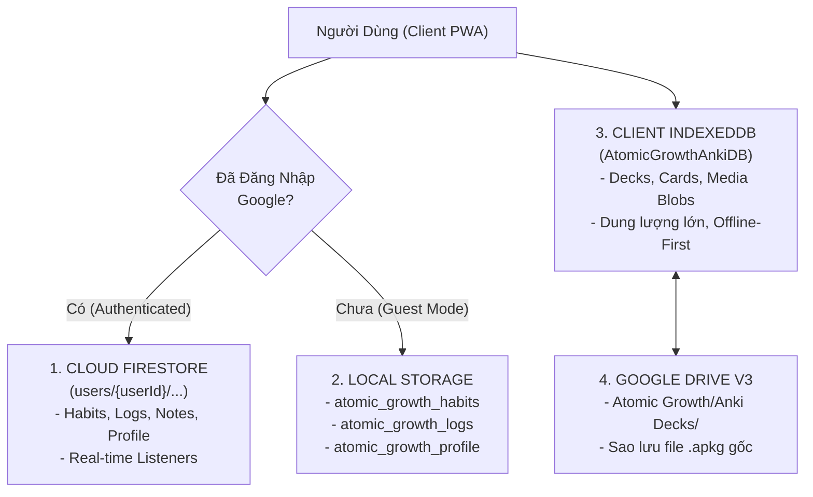
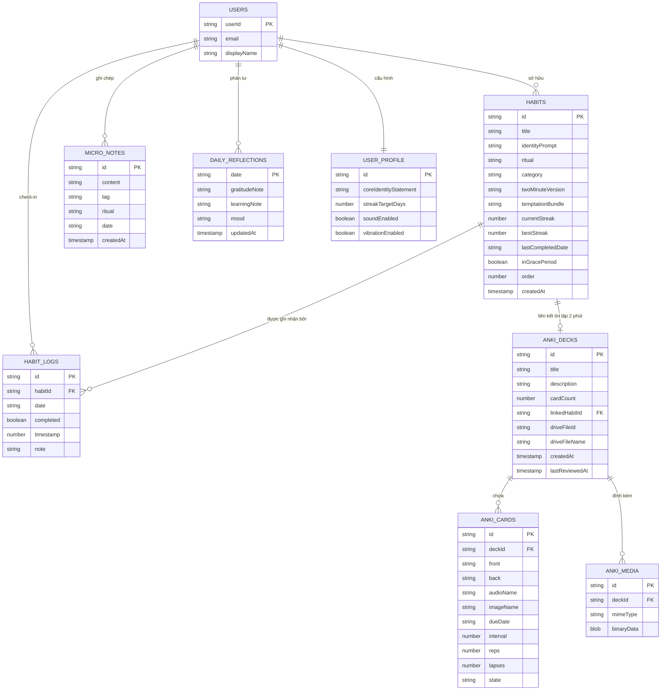
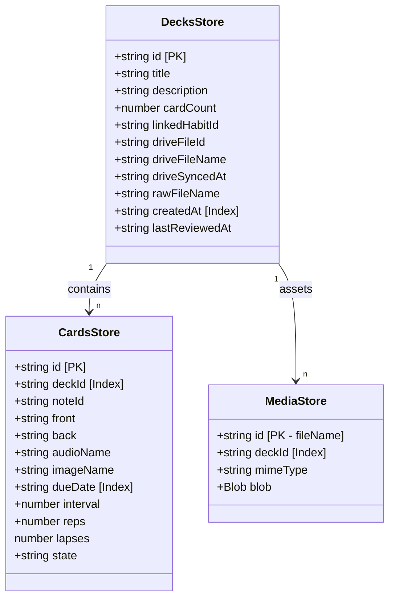

# Thiết Kế Cơ Sở Dữ Liệu: Atomic Growth (Database Design)

> **Tài liệu:** Thiết kế Kiến trúc Dữ liệu & Lược đồ Cơ sở dữ liệu (Database Schema Architecture)  
> **Phiên bản:** 1.0.0  
> **Hệ thống lưu trữ:** Cloud Firestore (NoSQL) + Client IndexedDB (Media & Large Storage) + LocalStorage (Offline Guest) + Google Drive REST API (File Backup)  

---

## 1. Chiến Lược Lưu Trữ Đa Tầng (Multi-Tier Storage Architecture)

Hệ thống **Atomic Growth** áp dụng mô hình lưu trữ phân tầng lai (Hybrid Multi-Tier Storage) nhằm giải quyết bài toán: **Tốc độ phản hồi cực nhanh, khả năng hoạt động ngoại tuyến (Offline-First) và chi phí vận hành đám mây tối ưu**:



### Tại sao lại chia làm 4 tầng?
1. **Cloud Firestore (Tầng dữ liệu cốt lõi người dùng):** Lưu trữ thói quen, nhật ký check-in, phản tư vi mô. Nhẹ, có khả năng đồng bộ real-time giữa điện thoại và máy tính, truy vấn nhanh.
2. **Client IndexedDB (Tầng dữ liệu nhị phân & Flashcards dung lượng cao):** Một bộ thẻ Anki có thể chứa hàng trăm tệp MP3 phát âm và ảnh minh họa (50MB - 200MB). Nếu đẩy toàn bộ media này lên Firestore sẽ gây quá tải chi phí đọc/ghi và băng thông. Lưu trữ media tại IndexedDB giúp phát âm thanh và hiển thị ảnh tức thì với độ trễ 0ms.
3. **LocalStorage (Tầng trải nghiệm người dùng vãng lai):** Giúp người dùng trải nghiệm ứng dụng ngay lập tức mà không bắt buộc phải đăng nhập tài khoản ngay.
4. **Google Drive (Tầng lưu trữ đám mây cá nhân):** Người dùng sở hữu 100% dữ liệu tệp `.apkg` của mình trên Google Drive cá nhân, giúp họ có thể khôi phục sang bất kỳ máy mới nào mà không phụ thuộc vào server trung gian.

---

## 2. Sơ Đồ Thực Thể & Liên Kết (Entity Relationship Diagram - ERD)



---

## 3. Đặc Tả Chi Tiết Lược Đồ (Schema Specifications)

### 3.1. Tầng 1: Cloud Firestore (NoSQL Document Store)
Mỗi người dùng được phân vùng riêng biệt theo đường dẫn: `/users/{userId}/...`

#### 3.1.1. Collection: `users/{userId}/profile/main`
* **Mô tả:** Chứa thông tin hồ sơ, tuyên ngôn bản sắc trung tâm và cài đặt ứng dụng.
* **Document ID:** `main` (Cố định 1 document duy nhất).
* **Cấu trúc trường:**
  | Tên Trường | Kiểu Dữ Liệu | Bắt Buộc | Mô Tả & Ý Nghĩa |
  | :--- | :--- | :---: | :--- |
  | `id` | `string` | Có | ID người dùng (`userId`) |
  | `name` | `string` | Có | Tên hiển thị của người dùng |
  | `coreIdentityStatement` | `string` | Có | Tuyên ngôn bản sắc chủ đạo (VD: *"Tôi là người kiên trì và tĩnh tại"*) |
  | `streakTargetDays` | `number` | Có | Mục tiêu chuỗi kiên trì tối thiểu (Mặc định: `21`) |
  | `soundEnabled` | `boolean` | Có | Bật/tắt âm thanh chuông gõ bát Zen khi check-in |
  | `vibrationEnabled` | `boolean` | Có | Bật/tắt phản hồi rung haptic trên thiết bị di động |

---

#### 3.1.2. Collection: `users/{userId}/habits/{habitId}`
* **Mô tả:** Danh sách các thói quen người dùng đang gieo mầm và duy trì.
* **Document ID:** `habitId` (UUID ngẫu nhiên dạng v4).
* **Cấu trúc trường:**
  | Tên Trường | Kiểu Dữ Liệu | Bắt Buộc | Mô Tả & Ý Nghĩa |
  | :--- | :--- | :---: | :--- |
  | `id` | `string` | Có | Mã định danh duy nhất của thói quen |
  | `title` | `string` | Có | Tên hành động thói quen (VD: *"Đọc sách 15 phút"*) |
  | `identityPrompt` | `string` | Không | Câu khẳng định bản sắc (VD: *"Tôi là người ham học hỏi"*) |
  | `ritual` | `string` | Có | Khối nhịp sinh học: `'morning'` \| `'midday'` \| `'evening'` |
  | `category` | `string` | Có | Danh mục: `'health'` \| `'mind'` \| `'focus'` \| `'gratitude'` |
  | `twoMinuteVersion` | `string` | Không | Phiên bản vi mô 2 phút (VD: *"Đọc 1 trang sách"*) |
  | `temptationBundle` | `string` | Không | Cặp đôi cám dỗ kết hợp (VD: *"Vừa nghe nhạc Lofi vừa đọc"*) |
  | `currentStreak` | `number` | Có | Số ngày liên tiếp hoàn thành hiện tại |
  | `bestStreak` | `number` | Có | Kỷ lục chuỗi ngày dài nhất từng đạt |
  | `lastCompletedDate` | `string` | Không | Ngày hoàn thành gần nhất theo định dạng `YYYY-MM-DD` |
  | `inGracePeriod` | `boolean` | Không | Cờ đánh dấu đang trong thời gian ân hạn "Never Miss Twice" |
  | `order` | `number` | Có | Thứ tự sắp xếp hiển thị trên giao diện Timeline |
  | `createdAt` | `string` | Có | Thời điểm tạo bản ghi (ISO 8601 string) |

---

#### 3.1.3. Collection: `users/{userId}/logs/{logId}`
* **Mô tả:** Lịch sử chi tiết từng lần check-in của mỗi thói quen theo ngày (dùng để vẽ Garden Heatmap và tính toán streak).
* **Document ID:** `logId` (Format đề xuất: `${habitId}_${date}` hoặc UUID ngẫu nhiên).
* **Cấu trúc trường:**
  | Tên Trường | Kiểu Dữ Liệu | Bắt Buộc | Mô Tả & Ý Nghĩa |
  | :--- | :--- | :---: | :--- |
  | `id` | `string` | Có | Mã định danh duy nhất của lượt log |
  | `habitId` | `string` | Có | Foreign Key tham chiếu tới thói quen tương ứng |
  | `date` | `string` | Có | Ngày check-in theo định dạng `YYYY-MM-DD` |
  | `completed` | `boolean` | Có | Trạng thái hoàn thành (`true`/`false`) |
  | `timestamp` | `number` | Có | Unix Epoch timestamp tính bằng mili-giây (`Date.now()`) |
  | `note` | `string` | Không | Ghi chú ngắn đi kèm khi check-in |

---

#### 3.1.4. Collection: `users/{userId}/notes/{noteId}`
* **Mô tả:** Ghi chép phản tư vi mô tức thì (Micro-Notes) theo phong cách Flomo / FlareMo.
* **Document ID:** `noteId` (UUID ngẫu nhiên).
* **Cấu trúc trường:**
  | Tên Trường | Kiểu Dữ Liệu | Bắt Buộc | Mô Tả & Ý Nghĩa |
  | :--- | :--- | :---: | :--- |
  | `id` | `string` | Có | Mã định danh duy nhất của ghi chép |
  | `content` | `string` | Có | Nội dung văn bản của ghi chú suy ngẫm |
  | `tag` | `string` | Không | Nhãn chủ đề (VD: `health`, `mind`, `focus`) |
  | `ritual` | `string` | Không | Nhịp sinh học lúc ghi chép (`morning`, `midday`, `evening`) |
  | `date` | `string` | Có | Ngày ghi chép (`YYYY-MM-DD`) |
  | `createdAt` | `string` | Có | Thời điểm tạo bản ghi (ISO 8601 string) |

---

#### 3.1.5. Collection: `users/{userId}/reflections/{date}`
* **Mô tả:** Bản suy ngẫm tổng kết cuối ngày (Daily Evening Reflection).
* **Document ID:** `date` (Định dạng `YYYY-MM-DD`, mỗi ngày có tối đa 1 bản ghi duy nhất).
* **Cấu trúc trường:**
  | Tên Trường | Kiểu Dữ Liệu | Bắt Buộc | Mô Tả & Ý Nghĩa |
  | :--- | :--- | :---: | :--- |
  | `date` | `string` | Có | Ngày phản tư (`YYYY-MM-DD`) |
  | `gratitudeNote` | `string` | Có | 1 điều biết ơn trong ngày |
  | `learningNote` | `string` | Không | 1 bài học hoặc phát hiện mới về bản thân |
  | `mood` | `string` | Không | Tâm trạng: `'serene'` \| `'energized'` \| `'tired'` \| `'reflective'` |
  | `updatedAt` | `string` | Có | Thời điểm cập nhật cuối cùng (ISO 8601 string) |

---

### 3.2. Tầng 2: Client IndexedDB (`AtomicGrowthAnkiDB`)
Sử dụng chuẩn Web API IndexedDB phiên bản 1 (`DB_VERSION = 1`).



#### 3.2.1. Object Store: `decks`
* **KeyPath:** `id` (string).
* **Indexes:**
  * `createdAt` (keyPath: `createdAt`, unique: `false`).
* **Ý nghĩa:** Quản lý danh mục các bộ thẻ flashcards đã nạp từ Anki `.apkg`. Hỗ trợ liên kết thói quen qua `linkedHabitId` và liên kết file Google Drive qua `driveFileId`.

#### 3.2.2. Object Store: `cards`
* **KeyPath:** `id` (string).
* **Indexes:**
  * `deckId` (keyPath: `deckId`, unique: `false`): Dùng để truy vấn toàn bộ thẻ thuộc 1 bộ bài.
  * `dueDate` (keyPath: `dueDate`, unique: `false`): Dùng để lọc nhanh danh sách thẻ đến hạn cần ôn tập hôm nay (`getDueCards`).
* **Thuật toán lặp lại ngắt quãng (SRS):**
  * `state`: `'new'` (Mới), `'learning'` (Đang học), `'review'` (Ôn tập), `'mastered'` (Đã thành thạo).
  * `interval`: Khoảng cách ngày tăng dần (1 ngày, 3 ngày, 7 ngày, 16 ngày...) mỗi khi bấm "Đã nhớ". Nếu bấm "Cần ôn lại", `interval` reset về 1 ngày và tăng `lapses`.

#### 3.2.3. Object Store: `media`
* **KeyPath:** `id` (Tên tệp tin gốc trong file nén Anki, ví dụ: `paste-12345.png` hoặc `apple_pronunciation.mp3`).
* **Indexes:**
  * `deckId` (keyPath: `deckId`, unique: `false`): Giúp xóa sạch toàn bộ media liên quan khi người dùng xóa bộ thẻ.
* **Đặc tính kỹ thuật:** Trường `blob` lưu trữ nhị phân trực tiếp. Khi render ra HTML của thẻ học, hệ thống tạo `URL.createObjectURL(blob)` tạm thời và giải phóng qua `URL.revokeObjectURL(url)` khi đóng component để chống rò rỉ bộ nhớ (Memory Leak).

---

### 3.3. Tầng 3: LocalStorage (Guest Mode & Offline Fallback)
Khi người dùng chưa đăng nhập, các key sau được sử dụng:
| Key | Kiểu Dữ Liệu | Nội Dung |
| :--- | :--- | :--- |
| `atomic_growth_habits` | JSON String (`Habit[]`) | Danh sách thói quen mẫu hoặc do khách tạo |
| `atomic_growth_logs` | JSON String (`HabitLog[]`) | Lịch sử check-in của khách |
| `atomic_growth_profile` | JSON String (`UserProfile`) | Hồ sơ khách và cài đặt âm thanh/rung |
| `atomic_growth_notes` | JSON String (`MicroNote[]`) | Ghi chú phản tư của khách |

---

### 3.4. Tầng 4: Google Drive REST API Storage
* **Thư mục mẹ:** `Atomic Growth` (nằm ở thư mục gốc của Drive người dùng).
* **Thư mục con:** `Anki Decks` (nằm bên trong `Atomic Growth`).
* **Quy chuẩn lưu trữ tệp:**
  * Định dạng: `.apkg` (Anki Package nguyên bản).
  * Tên tệp: Trùng với tên file lúc tải lên (hoặc chuẩn hóa theo tên bộ thẻ).
  * Phương thức tải: Google Drive Resumable Upload API với chunk size 4MB (`CHUNK_SIZE = 4 * 1024 * 1024`).

---

## 4. Quy Chuẩn An Toàn & Toàn Vẹn Dữ Liệu (Data Integrity & Security)

### 4.1. Quy Tắc Bắt Buộc: Zero Mock Data On Authenticated Cloud
> [!CAUTION]
> Tuyệt đối không tự động chạy seed dữ liệu mẫu (mock data) vào Firestore khi người dùng đăng nhập tài khoản Google thật. Tài khoản mới phải là **Tài khoản sạch hoàn toàn (0 thói quen)** để đảm bảo sự chân thực và tôn trọng hành trình phát triển cá nhân của người dùng.

### 4.2. Quy Tắc Bảo Mật Firestore (`firestore.rules`)
```javascript
rules_version = '2';
service cloud.firestore {
  match /databases/{database}/documents {
    // Chỉ chủ sở hữu tài khoản mới có quyền đọc và ghi vào tài liệu của chính mình
    match /users/{userId}/{document=**} {
      allow read, write: if request.auth != null && request.auth.uid == userId;
    }
  }
}
```

### 4.3. Quy Tắc Đồng Bộ & Khôi Phục (Sync & Recovery Flow)
1. **Lắng nghe Real-time:** Sử dụng `onSnapshot` của Firestore SDK. Mọi thay đổi từ thiết bị này sẽ lập tức phản ánh trên các thiết bị khác đang mở cùng tài khoản.
2. **Chiến lược giải quyết xung đột (Conflict Resolution):** Áp dụng chiến lược **Last-Write-Wins (LWW)** dựa trên timestamp của từng bản ghi.
3. **Sao lưu & Dọn dẹp:** Khi xóa một bộ thẻ trong IndexedDB, toàn bộ các bản ghi trong store `decks`, `cards` và toàn bộ media trong store `media` có cùng `deckId` sẽ được xóa sạch trong cùng một transaction để bảo toàn dung lượng thiết bị.
