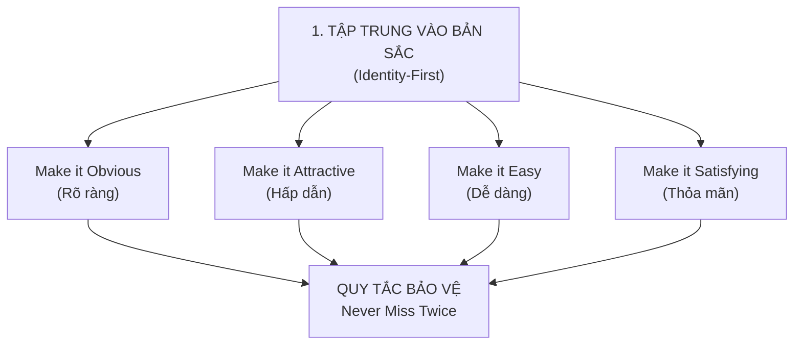
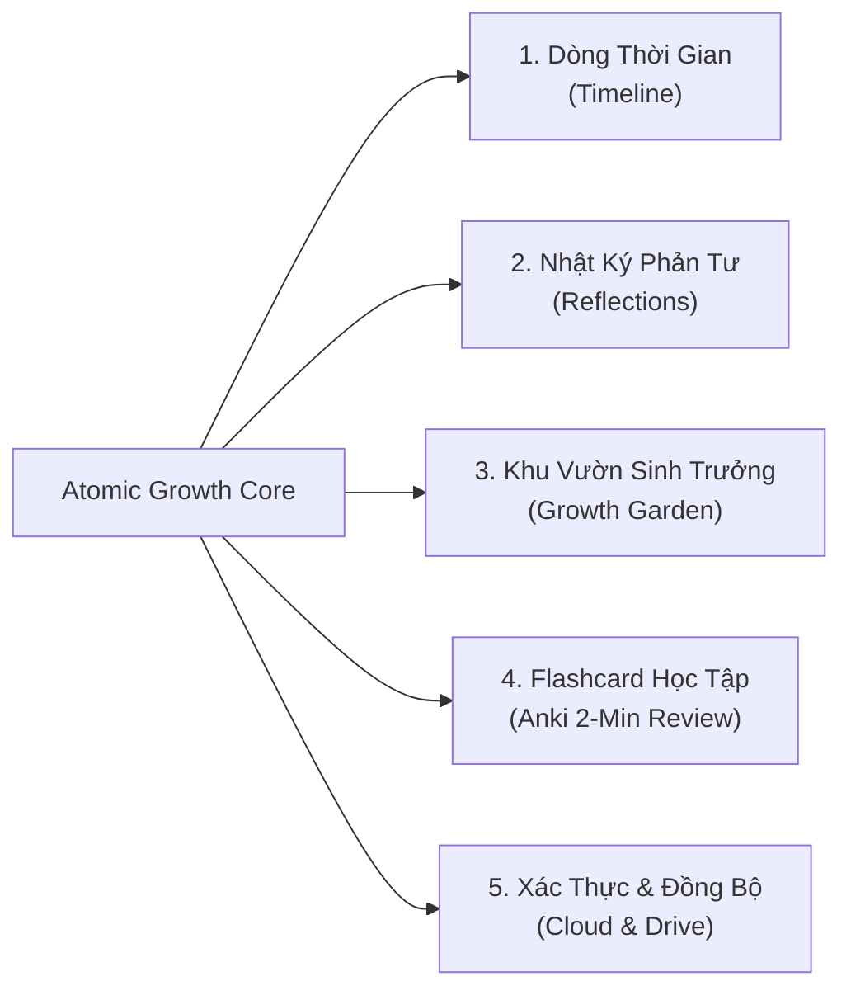

# Đặc Tả Dự Án: Atomic Growth (Project Specification)

> **Tên dự án:** Atomic Growth — Habit Tracker & Self-Development Hub  
> **Phiên bản tài liệu:** 1.0.0  
> **Trạng thái:** Hoạt động (Active)  
> **Quy chuẩn thiết kế:** [DESIGN.md](../DESIGN.md) (*Botanical Zen Minimalist*)  
> **Quy chuẩn lập trình:** [AGENTS.md](../AGENTS.md)  

---

## 1. Giới Thiệu & Tầm Nhìn (Vision & Objectives)

### 1.1. Bối Cảnh & Vấn Đề
Phần lớn các ứng dụng theo dõi thói quen hiện nay sa vào hai cạm bẫy:
1. **Bảng đếm số vô hồn (Dopamine Trap):** Tập trung thái quá vào số chuỗi (streak) và biểu đồ phức tạp, tạo cảm giác tội lỗi và áp lực khi người dùng lỡ một ngày, dẫn đến việc bỏ cuộc hàng loạt (Hiệu ứng "Kệ nó đi" - What-the-hell effect).
2. **Giao diện rườm rà (UI Clutter):** Nhồi nhét quá nhiều widget, nhật ký, trích dẫn triết lý và quảng cáo trên cùng một màn hình, làm phân tán sự tập trung thay vì hỗ trợ hành động.

### 1.2. Tầm Nhìn Dự Án
**Atomic Growth** là ứng dụng xây dựng thói quen và phát triển bản thân bền vững, ứng dụng triệt để tâm lý học hành vi từ cuốn sách kinh điển **Atomic Habits** của James Clear, kết hợp với tinh thần tĩnh tại của phong cách **Botanical Zen Minimalist**.

Ứng dụng không xem người dùng là "cỗ máy năng suất", mà là một **người làm vườn kiên nhẫn** chăm sóc từng hạt mầm bản sắc mỗi ngày.

---

## 2. Các Trụ Cột Phương Pháp Luận (Core Methodology)

### 2.1. Tập Trung Vào Bản Sắc (Identity-First Habits)
* **Nguyên lý:** Thay đổi bền vững không bắt đầu từ kết quả (*Tôi muốn đọc 30 cuốn sách*), cũng không phải quy trình (*Tôi đọc mỗi ngày 30 phút*), mà bắt đầu từ **Bản sắc** (*Tôi là một người ham học hỏi*).
* **Ứng dụng:** Mỗi thói quen bắt buộc hoặc khuyến khích gắn liền với một câu khẳng định bản sắc (`identityPrompt`). Mỗi lần nhấn check-in được định nghĩa là **"Một lá phiếu bầu cho con người bạn muốn trở thành"**.

### 2.2. Bốn Quy Luật Thay Đổi Hành Vi
1. **Make it Obvious (Làm cho rõ ràng):**
   * Phân nhóm theo nhịp sinh học tự nhiên: **Buổi sáng (Morning)**, **Buổi chiều (Midday)**, **Buổi tối (Evening)**.
   * Xếp chồng thói quen (Habit Stacking): Gắn thói quen mới vào sau một thói quen cũ đã có sẵn.
2. **Make it Attractive (Làm cho hấp dẫn):**
   * Cặp đôi cám dỗ (Temptation Bundling): Kết hợp việc *cần làm* với việc *thích làm* (`temptationBundle`).
3. **Make it Easy (Làm cho dễ dàng):**
   * **Quy tắc 2 phút (The 2-Minute Rule):** Mọi thói quen đều có phiên bản vi mô khởi đầu trong vòng 2 phút (`twoMinuteVersion`).
   * Thao tác 1-chạm (1-tap check-in), giao diện Bottom Sheet bám đáy màn hình tối ưu tầm với ngón cái.
4. **Make it Satisfying (Làm cho thỏa mãn):**
   * Phản hồi thị giác tức thì: Hiệu ứng chuyển động mầm cây, confetti ăn mừng tinh tế.
   * Trực quan hóa tiến độ thông qua **Khu vườn sinh trưởng (Garden Heatmap)** thay vì bảng số khô khan.

### 2.3. Quy Tắc "Never Miss Twice" (Không Bao Giờ Bỏ Lỡ Hai Lần)
* Khi người dùng lỡ quên check-in 1 ngày, chuỗi streak **không bị reset về 0 ngay lập tức**.
* Hệ thống kích hoạt cơ chế ân hạn nhân ái (`inGracePeriod: true`), hiển thị thông báo động viên ngữ cảnh để nhắc nhở người dùng hoàn thành thói quen trong ngày tiếp theo để bảo toàn chuỗi.

---

## 3. Kiến Trúc Chức Năng (Functional Specifications)

### 3.1. Phân Hệ 1: Dòng Thời Gian Thói Quen (Timeline)
* **Tiêu điểm tối thượng:** Dành 90% không gian cho việc check-in thói quen trong ngày.
* **Bộ lọc Nhịp sinh học (Ritual Filter):**
  * Tất cả (All), Buổi sáng (Morning), Buổi chiều (Midday), Buổi tối (Evening).
* **Thẻ thói quen (Habit Item Card):**
  * Tên thói quen và câu khẳng định bản sắc ngắn.
  * Huy hiệu nhịp sinh học và danh mục (Sức khỏe, Trí tuệ, Tập trung, Biết ơn).
  * Phiên bản 2 phút (hiển thị khi cần tinh gọn).
  * Nút check-in tương tác: Chạm 1-tap để hoàn thành, kích hoạt haptic và âm thanh tự nhiên (tùy chọn).
* **Bộ chọn ngày (Date Strip):** Cho phép xem lại tiến độ tuần và check-in bù hôm qua nếu cần kích hoạt quy tắc hồi phục.

### 3.2. Phân Hệ 2: Nhật Ký Phản Tư (Reflections Feed)
* **Tách biệt không gian:** Nằm hoàn toàn độc lập với Timeline để chống rườm rà.
* **Ghi chép vi mô (Micro-Jotting / Flomo-style):**
  * Nhập nhanh suy nghĩ tức thời, chọn nhãn (Health, Focus, Gratitude) và nhịp sinh học.
  * Dòng thời gian hiển thị các ghi chú ngắn theo thứ tự thời gian đảo ngược.
* **Suy ngẫm cuối ngày (Daily Evening Reflection):**
  * Ghi nhận 1 điều biết ơn trong ngày (`gratitudeNote`).
  * 1 bài học rút ra (`learningNote`).
  * Đánh giá tâm trạng tĩnh tại (`mood`: serene, energized, tired, reflective).

### 3.3. Phân Hệ 3: Khu Vườn Sinh Trưởng (Growth Garden & Analytics)
* **Bản Đồ Nhiệt Sinh Trưởng (Garden Heatmap):**
  * Lưới ô vuông trực quan hóa mật độ hoàn thành thói quen theo từng ngày trong tháng/năm.
  * Màu sắc chuyển dịch từ Alabaster Linen (`#F8F7F2`) sang Sage Green (`#528B70`) và Deep Cypress (`#205A42`).
* **Chỉ số Sức mạnh Bản sắc:**
  * Tỉ lệ hoàn thành trung bình (Completion Rate %).
  * Tổng số "phiếu bầu bản sắc" đã gieo.
  * Chuỗi ngày dài nhất (Best Streak) và chuỗi hiện tại (Current Streak).

### 3.4. Phân Hệ 4: Tích Hợp Thẻ Học Anki (Micro-Learning 2 Phút)
* **Nhập tệp Anki (`.apkg`):**
  * Bóc tách file nén `.apkg` trực tiếp trên trình duyệt bằng JSZip và SQL.js (WebAssembly).
  * Trích xuất thông tin bộ thẻ (Decks), danh sách thẻ (Cards), câu hỏi mặt trước, giải nghĩa mặt sau và Cloze deletion.
  * Tách xuất toàn bộ tệp âm thanh (MP3) và hình ảnh đính kèm lưu vào bộ nhớ cục bộ.
* **Trình Lật Thẻ Zen (ZenFlashcardViewer):**
  * Thiết kế dạng **Bottom Sheet** bám sát đáy màn hình trên Mobile / PWA, tối ưu cho ngón tay cái.
  * Phiên học giới hạn tối đa **10 thẻ / 2 phút** đúng theo quy tắc "Make it Easy".
  * Thuật toán ngắt quãng Spaced Repetition (SRS): Phân loại `Again` (Cần ôn lại) và `Remembered` (Đã nhớ).
  * Tự động phát âm thanh bản ngữ và hiển thị hình ảnh minh họa.
  * Đánh dấu hoàn thành thói quen tương ứng trên Timeline sau khi kết thúc phiên.
* **Sao Lưu & Đồng Bộ Google Drive Cá Nhân:**
  * Tải trực tiếp file `.apkg` lên thư mục riêng biệt của người dùng: `Atomic Growth/Anki Decks/`.
  * Hỗ trợ tải lên chia gói (Resumable Upload Chunk 4MB) cho các tệp lớn.
  * 1-click khôi phục bộ thẻ từ Drive về thiết bị mới mà không lo mất dữ liệu.

### 3.5. Phân Hệ 5: Xác Thực & Đồng Bộ Đám Mây (Cloud & Auth)
* **Xác thực Google OAuth2:** Đăng nhập 1 chạm an toàn qua Firebase Authentication.
* **Chính Sách Tài Khoản Sạch (Zero Mock Data on Auth):**
  * Khi người dùng đăng nhập tài khoản Google mới, Firestore của họ hoàn toàn sạch (0 thói quen).
  * Tuyệt đối không tự động gieo dữ liệu giả vào Cloud của người dùng thật.
* **Chế độ Ngoại tuyến (Guest / Offline Mode):**
  * Lưu trữ trên LocalStorage cục bộ, cung cấp các thói quen mẫu để người dùng khám phá trước khi quyết định đăng nhập.

---

## 4. Quy Chuẩn Giao Diện (Design System & Aesthetics)

* Chi tiết quy chuẩn được quy định tại [DESIGN.md](../DESIGN.md).
* **Bảng màu cốt lõi:**
  | Tên Màu | Mã HEX | Mục Đích Sử Dụng |
  | :--- | :--- | :--- |
  | **Alabaster Linen** | `#F8F7F2` | Nền Canvas chính (ấm áp, dịu mắt, chống mỏi) |
  | **Pure Surface** | `#FFFFFF` | Nền các thẻ Card nội dung nổi bật |
  | **Deep Cypress Ink** | `#205A42` | Màu mực chính, thương hiệu, nút nhấn hành động chính |
  | **Forest Charcoal** | `#1C2621` | Màu chữ chính (thay thế màu đen thuần `#000000`) |
  | **Sage Green** | `#528B70` | Màu nhấn sinh trưởng, hoàn thành, trạng thái tích cực |
  | **Sprout Mist** | `#E5EFEA` | Nền thẻ hoàn thành nhẹ nhàng, badge |
  | **Terracotta Clay** | `#C97255` | Điểm nhấn đất nung, cảnh báo nhẹ, nút cần ôn lại |
  | **Warm Amber Ochre** | `#D89839` | Màu chuỗi kiên trì (Streak badge), ngôi sao |
* **Typography:**
  * Tiêu đề & Trích dẫn danh tính: `Newsreader` (Serif).
  * Nội dung & Thao tác UI: `Plus Jakarta Sans` (Sans-serif).
  * Số liệu, Đo lường, Streak: `JetBrains Mono` (Monospace).

---

## 5. Yêu Cầu Phi Chức Năng (Non-Functional Requirements)

1. **Hiệu Năng & Tốc Độ:**
   * Thời gian nạp trang đầu (First Contentful Paint) < 1.0s.
   * Kích thước bundle tối ưu, hỗ trợ lazy-loading cho các thư viện nặng (SQL.js, JSZip).
2. **Hỗ Trợ Ứng Dụng Web Lũy Tiến (PWA):**
   * Khả năng cài đặt lên màn hình chính (Add to Home Screen) trên cả iOS và Android.
   * Hoạt động trơn tru trong điều kiện mất kết nối Internet thông qua Service Worker.
   * Xử lý chuẩn Safe Area (`pb-safe`, `pt-safe`) trên thiết bị có tai thỏ / thanh điều hướng cử chỉ.
3. **Bảo Mật & Riêng Tư Dữ Liệu:**
   * Phạm vi ủy quyền Google Drive tối thiểu: `https://www.googleapis.com/auth/drive.file` (chỉ truy cập các tệp do chính ứng dụng tạo ra).
   * Firestore Security Rules bảo vệ nghiêm ngặt: Mỗi người dùng chỉ có quyền đọc/ghi dữ liệu trong subtree `users/{userId}` của chính mình.
